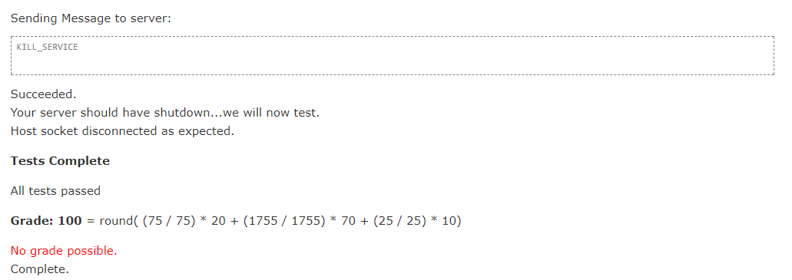

# Chat Server
- **Paul Shanahan** - MAI Computer Engineering

This chat server is built using Java. Please note that for the first number of weeks, I did make reasonable progress using Haskell which can be seen from earlier commits.
I was struggling to pass the online test using Haskell due to parsing problems I was experiencing.

The server meets all requirements outlined at:
-[Server Spec](https://www.scss.tcd.ie/Stephen.Barrett/teaching/CS4400/chat_server_task.html) - TCD Credentials Required

The server records a score of 100/100 when tested.

### System Requirements
```
Java Development Kit

Please ensure that Java Development Kit is installed before instantiating the server.
- http://www.oracle.com/technetwork/java/javase/downloads/index.html

```

### Running the Server

The server can be ran with the following scripts (ensure they have executable permissions):
- Compile: `./compile.sh`
- Run: `./start.sh <port>`


### Screengrab from Test
